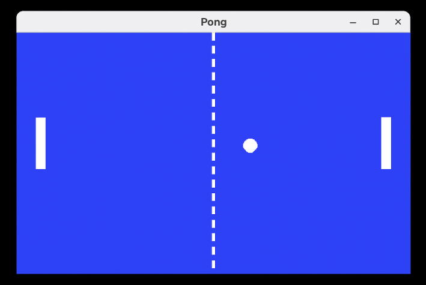
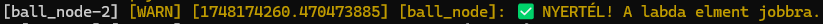
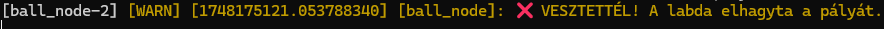

# `ros_pong_semiautomatic` package  
Pong játék ROS 2-ben, Python segítségével, turtlesim és PyGame vizualizációval.  
[](https://docs.ros.org/en/humble/)

Ez a csomag egy egyszerű **Pong** játékot valósít meg ROS 2 környezetben.  
A labda (`turtle1`) két ütő (teknős) között mozog, és szögekben pattan vissza. A bal ütő (`turtle2`) kézzel irányítható, míg a jobb oldali ütő (`turtle3`) egy mesterséges intelligencia által vezérelt bot, amely próbálja követni a labdát — de verhető. 🏓

---

## Készítette:
**Szabó Áron I5EE5T és Kucserka Szabolcs ULD7BX** fejlesztette ezt a projektet tanulási célból.

---

## !Funkciók!

- A labda szögben pattog az ütőkről
- Falról **nem pattan vissza**, csak ütőről
- Győzelem/vereség detektálás, ha a labda elhagyja a pályát
- Jobb oldali ütő követi a labdát, de hibázhat
- Bal oldali ütő `w/s` billentyűkkel vezérelhető
- Egy felhasználó számára könnyebben értelmezhető PyGame vizualizációs ablak is fut.

---

## 📦 Használat-  Három terminálba kell megynyitni az elsőben a következő kódokkal elinditjuk a játékot a második terminálba a saját oldalunkat inditjuk el és w,s billentyű bemeneteket érzékeli, a harmadik pedig a PyGame vizualizációt jeleníti meg.


### 1.Terminál

```bash
cd ~/ros2_ws/src
git clone https://github.com/sze-info/ros2_py_template.git ros_pong_semiautomatic

 cd ros2_ws/

colcon build --packages-select ros_pong_semiautomatic
 . install/setup.bash
 ros2 launch ros_pong_semiautomatic launch_example1.launch.py
```


### 2.Terminál (Fontos hogy miután mind a három node elindításra került, mindenképp ez a terminál legyen megnyitva aktívan, ugyanis ez kezeli a felhasználói inputokat.)
```bash
cd ~/ros2_ws/src
git clone https://github.com/sze-info/ros2_py_template.git ros_pong_semiautomatic

 cd ros2_ws/
 colcon build --packages-select ros_pong_semiautomatic
 . install/setup.bash
 ros2 run ros_pong_semiautomatic paddle_node
```

### 3.Terminál (PyGame vizualizációs ablak)
```bash
cd ~/ros2_ws/src
git clone https://github.com/sze-info/ros2_py_template.git ros_pong_semiautomatic

 cd ros2_ws/
 colcon build --packages-select ros_pong_semiautomatic
 . install/setup.bash
 ros2 run ros_pong_semiautomatic pong_display_node
```


### Játékmenet

<p align="center">
  
</p>

<p align="center">
  
</p>

### Győzelem es vereség kiírása

<p align="center">
  
</p>
<p align="center">
  
</p>
 
